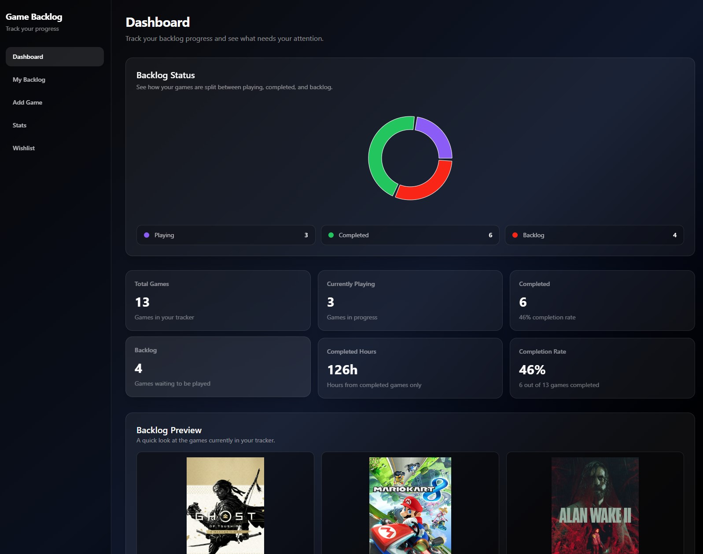

# Game Backlog Tracker

Game Backlog Tracker is a full-stack web app for organizing a personal video game backlog. The goal of the app is to help users track what they are playing, what they have completed, what is still waiting in their backlog, and what games they may want to play next.

This project is currently a work in progress.

## Preview

## Preview



## Features

- Account-based login and signup flow
- Protected dashboard route
- Dashboard overview with game summary cards
- Status breakdown chart using Recharts
- Backlog preview section
- My Backlog page with status filtering and search
- Add Game modal for adding user-specific game details
- Stats page with deeper backlog analytics
- Games by Platform chart
- Games by Genre chart
- Estimated backlog time summary using HowLongToBeat-style data
- Responsive dark glass-style UI built with Tailwind CSS

## Current Stats Page

The Stats page is designed to show deeper insights than the main dashboard. Current stats include:

- Total estimated time to complete backlog games
- Average backlog game length
- Longest backlog game
- Shortest backlog game
- Game count by platform
- Game count by genre

## Planned Features

- RAWG API integration for searching real game data
- Backend route for fetching and cleaning RAWG API results
- User-specific game storage with Supabase
- Save games per logged-in account
- Edit and delete saved games
- Sort backlog by shortest or longest estimated completion time
- Filter backlog by platform, genre, priority, and status
- Wishlist page
- Improved recommendation features for choosing what to play next

## Tech Stack

### Frontend

- React
- Vite
- React Router
- Tailwind CSS
- Recharts

### Backend

- Node.js
- Express
- JWT authentication
- bcryptjs for password hashing

### Planned Data/API Tools

- Supabase for database storage
- RAWG API for game data

## Project Architecture

The app is being built with a traditional frontend/backend structure.

```txt
Frontend React app
  ↓
Express backend API
  ↓
External services / database
```

For the planned RAWG API feature, the frontend will not call RAWG directly. Instead, the frontend will send a search request to the Express backend. The backend will call RAWG, clean the response, and send useful game data back to the frontend.

```txt
Frontend Add Game page
  ↓
Express backend route
  ↓
RAWG API
  ↓
Backend sends cleaned game data
  ↓
Frontend displays results
```

When a user saves a game, the final saved object will combine public RAWG game data with user-specific tracking data.

```txt
RAWG data + user data = saved user game
```

Example user-specific fields:

- Status
- Selected platform
- Priority
- Notes
- Date added

Each saved game will eventually be connected to the logged-in user's account in Supabase.

## Getting Started

### 1. Clone the repository

```bash
git clone <repo-url>
cd <repo-name>
```

### 2. Install frontend dependencies

```bash
cd client
npm install
```

### 3. Start the frontend

```bash
npm run dev
```

### 4. Install backend dependencies

```bash
cd ../server
npm install
```

### 5. Start the backend

```bash
npm run dev
```

## Current Status

The project currently has the main frontend layout, authentication flow, dashboard, backlog filtering, and stats page components working with mock game data. The next major feature is integrating the RAWG API so users can search for real games and add them to their personal backlog.

## Repository Description

A full-stack game backlog tracker for organizing, filtering, and analyzing a personal video game collection.
