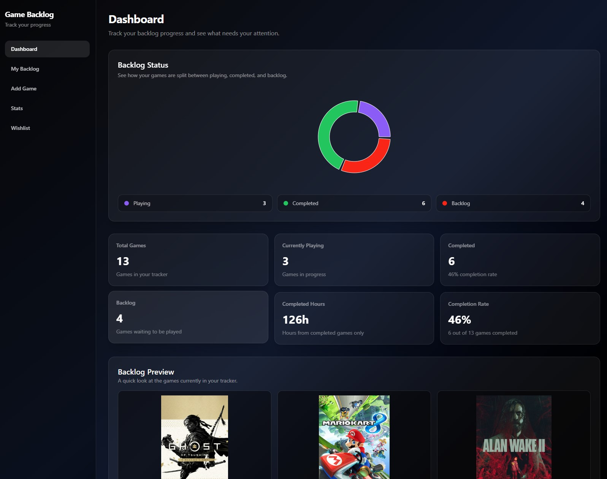

# Game Backlog Tracker

Game Backlog Tracker is a full-stack web app for organizing and analyzing a personal video game backlog. It helps users keep track of games they are playing, games they have completed, games waiting in their backlog, and games they may want to play in the future.

The app combines account-based game tracking with data from the RAWG API so users can search for games, save them to their own collection, and view useful backlog stats.

## Live Demo

[View the deployed app 🚀](https://game-backlog-tracker.netlify.app/)

## Preview



## Features

- Account-based signup and login
- Protected dashboard routes
- User-specific game storage with Supabase
- Sidebar account display with logout support
- Dashboard overview with backlog summary cards
- Backlog preview section
- Status breakdown chart using Recharts
- My Backlog page with search and status filtering
- Add Game flow powered by RAWG API search results
- Save and delete games per logged-in account
- Game detail pages with richer game information
- Media section with game screenshots
- Fullscreen screenshot viewer for browsing game images
- Stats page with deeper backlog analytics
- Games by Platform chart
- Games by Genre chart
- Estimated backlog time summary using average playtime data
- Wishlist page
- Responsive dark glass-style UI built with Tailwind CSS

## Stats Page

The Stats page gives users a deeper look at their backlog beyond the main dashboard.

Current stats include:

- Total estimated time to complete backlog games
- Average backlog game length
- Longest backlog game
- Shortest backlog game
- Game count by platform
- Game count by genre

## Tech Stack

<p>
  
  
  
  
  
</p>

<p>
  
  
  
  
</p>

<p>
  
  
  
  
</p>

### Frontend

- React
- Vite
- React Router
- Tailwind CSS
- Recharts

### Backend

- Node.js
- Express
- JWT authentication
- bcryptjs for password hashing

### Database and APIs

- Supabase for user-specific game storage
- RAWG API for game search, game details, and media data

### Deployment

- Frontend deployed on Netlify
- Backend deployed on Render
- Database hosted with Supabase

## Project Architecture

The app uses a traditional frontend/backend structure.

```txt
React frontend
  ↓
Express backend API
  ↓
Supabase / RAWG API
```

The frontend handles the user interface, routing, forms, dashboard views, backlog pages, and charts.

The Express backend handles authentication, protected API routes, communication with Supabase, and requests to the RAWG API.

Supabase stores user-specific game data, while RAWG provides public game data such as titles, images, platforms, genres, average playtime, and screenshots.

## RAWG API Flow

For game search and game details, the frontend does not call RAWG directly. Instead, the frontend sends requests to the Express backend. The backend calls RAWG, cleans the response, and sends only the useful game data back to the frontend.

```txt
Frontend request
  ↓
Express backend route
  ↓
RAWG API
  ↓
Backend cleans the data
  ↓
Frontend displays the result
```

This keeps the RAWG API key on the server and prevents it from being exposed in the frontend.

## Saving Games

When a user saves a game, the final saved object combines public RAWG game data with user-specific tracking data.

```txt
RAWG game data + user tracking data = saved user game
```

Example saved fields include:

- Game title
- Cover image
- Platforms
- Genres
- Average playtime
- Status
- Selected platform
- Notes
- Date added
- User account ID

Each saved game is connected to the logged-in user's account in Supabase, allowing every user to manage their own backlog separately.

## Getting Started

### 1. Clone the repository

```bash
git clone <repo-url>
cd <repo-name>
```

### 2. Install frontend dependencies

```bash
cd client
npm install
```

### 3. Create the frontend environment file

Inside the `client` folder, create a `.env` file:

```env
VITE_API_URL=http://localhost:5001
```

### 4. Start the frontend

```bash
npm run dev
```

### 5. Install backend dependencies

Open a second terminal and run:

```bash
cd server
npm install
```

### 6. Create the backend environment file

Inside the `server` folder, create a `.env` file:

```env
SUPABASE_URL=your_supabase_url
SUPABASE_SERVICE_ROLE_KEY=your_supabase_service_role_key
JWT_SECRET=your_jwt_secret
RAWG_API_KEY=your_rawg_api_key
CLIENT_URL=http://localhost:5173
```

### 7. Start the backend

```bash
npm start
```

## Environment Variables

### Frontend

| Variable | Description |
| --- | --- |
| `VITE_API_URL` | URL of the Express backend API |

### Backend

| Variable | Description |
| --- | --- |
| `SUPABASE_URL` | Supabase project URL |
| `SUPABASE_SERVICE_ROLE_KEY` | Supabase service role key used by the backend |
| `JWT_SECRET` | Secret used to sign authentication tokens |
| `RAWG_API_KEY` | API key for RAWG game data |
| `CLIENT_URL` | Frontend URL allowed by CORS |

## Current Status

Game Backlog Tracker is currently deployed as a full-stack MVP.

The app supports user authentication, protected routes, user-specific backlog storage, RAWG-powered game search, game detail pages, wishlist tracking, backlog stats, and responsive dashboard views.

The frontend is hosted on Netlify, the backend is hosted on Render, and user data is stored in Supabase.

## Future Improvements

Possible future improvements include:

- Editing saved games
- More advanced backlog filters
- Better recommendation features
- More detailed backlog analytics
- Sorting by playtime, release date, rating, or date added
- Improved mobile layout polish
- More detailed game detail pages
- Additional wishlist features

## Repository Description

A full-stack game backlog tracker for organizing, filtering, and analyzing a personal video game collection.